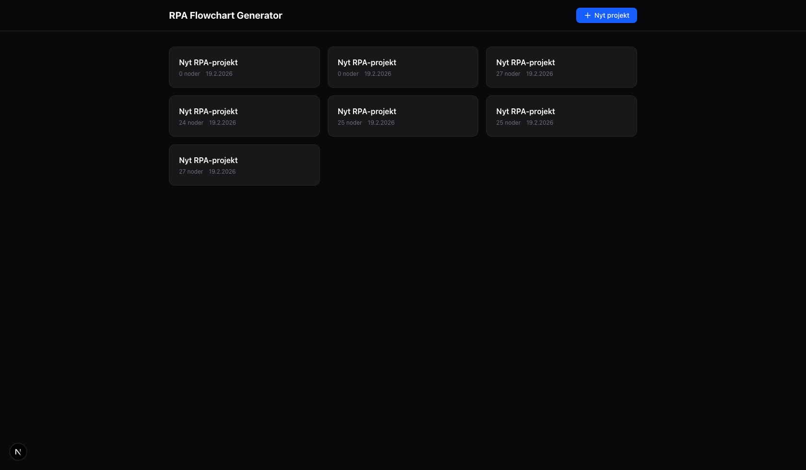
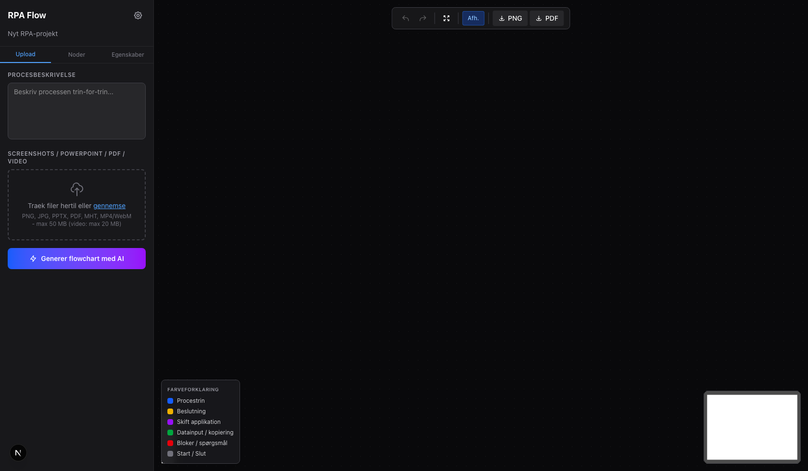
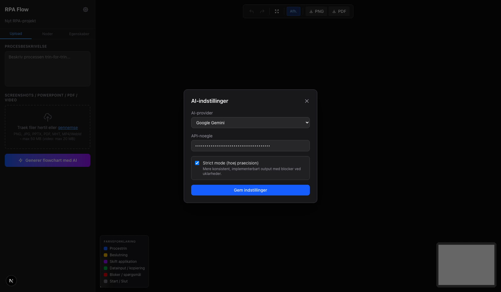

# RPA Flowchart Generator

AI-drevet webapplikation der genererer detaljerede, redigerbare RPA-flowcharts fra procesbeskrivelser, screenshots, dokumenter og video.

Bygget til RPA-teams der dokumenterer forretningsprocesser - upload en beskrivelse, dokumenter eller video, og faa et interaktivt swimlane-flowchart paa sekunder.


## Features

- **AI-generering** - Generer komplette flowcharts fra tekst og/eller screenshots med Claude, Google Gemini eller Azure OpenAI
- **PowerPoint-import** - Upload en eksisterende .pptx-fil og faa automatisk udtrukket tekst + billeder fra alle slides
- **PDF-import** - Upload PDF-dokumenter og brug udtrukket tekst som grundlag for AI-generering
- **MHT-import** - Upload .mht/.mhtml filer og udtraek procesrelevant tekst automatisk
- **Video-import (Gemini)** - Upload video med skaerm + tale og udtraek proceskontekst via multimodal analyse
- **Progress bar for lange imports** - Se status, procent og aktivt behandlingstrin under videoanalyse
- **Swimlane-layout** - Noder grupperes automatisk i swimlanes efter applikation (fx Outlook, DUBU, SAPA)
- **Trin og afhaengigheder** - Automatisk trin-nummerering, edge-labels og toggle for "Vis afhaengigheder"
- **Grupperet flowvisning** - Procesblokke med sektionstitler baseret paa indhold i trinnene
- **Strict mode** - Hoej-praecision prompt til mere implementerbart output for Power Automate-udviklere
- **6 RPA-specifikke nodetyper** - Procestrin, beslutning, applikationsskift, datainput, bloker og start/slut
- **Drag & drop editor** - Traek noder, opret forbindelser, rediger tekst direkte i browseren
- **Token-tracking** - Se hvilken AI-model der bruges og praecist antal input/output tokens
- **Prisestimat i DKK** - Estimeret API-omkostning vises ud fra tokenforbrug
- **Eksport** - Download som PNG eller PDF
- **Auto-gem** - Alle aendringer gemmes automatisk
- **Undo/redo** - Fortryd og gentag med Ctrl+Z / Ctrl+Y

## Seneste forbedringer (2026)

- Video ingestion med in-process jobstatus og progress bar
- MHT/MHTML parsing og import i procesbeskrivelsen
- Skarpere RPA/Power Automate prompt + Strict mode toggle i indstillinger
- Tydeligere flowlaesbarhed med trin, grupper og afhaengighedslabels
- Model/tid/token samt estimeret pris i danske kroner

## Screenshots

### Dashboard
Oversigt over alle projekter med antal noder og dato.



### Editor med gruppering og afhaengigheder
Flow med swimlanes, sektionstitler, trin-numre og afhaengighedslabels.



### AI-indstillinger med Strict mode
Vaelg AI-provider, API-noegle og strict mode for hoejere praecision.



### PowerPoint-import
Upload en .pptx-fil - tekst og billeder udtraekkes automatisk og sendes til AI.


### Token-forbrug
Efter generering vises model, provider og praecist token-forbrug.


## Tech Stack

| Komponent | Teknologi |
|-----------|-----------|
| Framework | Next.js 16 (App Router) |
| UI | React 19, Tailwind CSS v4 |
| Flowchart | @xyflow/react v12 |
| AI | Anthropic Claude, Google Gemini, Azure OpenAI |
| Database | SQLite (better-sqlite3) |
| Dokument parsing | JSZip + xml2js, pdfjs-dist, custom MHT parser |
| Video analyse | Gemini multimodal (video + cloud OCR + taleanalyse) |
| Eksport | html-to-image, jsPDF |

## Kom i gang

### Forudsaetninger

- Node.js 20+
- En API-noegle fra [Anthropic](https://console.anthropic.com/), [Google AI Studio](https://aistudio.google.com/) eller [Azure OpenAI](https://azure.microsoft.com/en-us/products/ai-services/openai-service)

### Installation

```bash
git clone https://github.com/Parthee-Vijaya/rpa-flowchart.git
cd rpa-flowchart
npm install
```

### Start

```bash
npm run dev
```

Aabn [http://localhost:3000](http://localhost:3000) i din browser.

### Konfigurer AI

1. Klik paa tandhjulsikonet i editoren
2. Vaelg AI-provider (Google Gemini anbefales til hurtig generering)
3. Indtast din API-noegle
4. Klik "Gem indstillinger"

## Brug

1. **Opret projekt** - Klik "+ Nyt projekt" paa dashboardet
2. **Tilfoej input** - Enten:
   - Skriv en procesbeskrivelse i tekstfeltet
   - Upload screenshots (PNG/JPG)
   - Upload en PowerPoint-fil (.pptx) - tekst og billeder udtraekkes automatisk
   - Upload en PDF-fil (.pdf) - tekst udtraekkes automatisk
   - Upload en MHT-fil (.mht/.mhtml) - tekst udtraekkes automatisk
   - Upload en video (.mp4/.webm/.mov) - tale + visuel kontekst udtraekkes med progress bar
3. **Generer** - Klik "Generer flowchart med AI"
4. **Rediger** - Traek noder, rediger tekst, tilfoej nye noder fra paletten
   - Brug toggle "Afh." i toolbar for at vise/skjule afhaengighedslabels
5. **Eksporter** - Klik PNG eller PDF i toolbaren

## Nodetyper

| Type | Farve | Beskrivelse |
|------|-------|-------------|
| Procestrin | Blaa | Standard handling (login, klik, navigation) |
| Beslutning | Gul | Ja/nej-forgrening |
| Skift applikation | Lilla | Skift mellem systemer |
| Datainput | Groen | Indtastning eller kopiering af data |
| Bloker | Roed | Problem der kraever menneskelig handling |
| Start/Slut | Graa | Processens graenser |

## Projektstruktur

```
src/
├── app/                    # Next.js App Router
│   ├── api/                # API-endpoints (generate, upload, import-pptx/pdf/mht/video, jobs, projects, settings)
│   ├── projects/[id]/      # Flowchart-editor side
│   └── page.tsx            # Dashboard
├── components/
│   ├── NodeTypes/          # 6 custom React Flow node-komponenter
│   ├── Sidebar/            # Node-palette + properties-panel
│   ├── FlowchartEditor.tsx # Hoved-editor med React Flow
│   ├── SwimlaneBackgrounds.tsx
│   ├── ColorLegend.tsx
│   └── ...
├── lib/
│   ├── ai/                 # Multi-provider AI-integration
│   │   ├── claude.ts       # Anthropic Claude
│   │   ├── gemini.ts       # Google Gemini
│   │   ├── gemini-video.ts # Gemini videoanalyse (cloud OCR + tale)
│   │   ├── azure-openai.ts # Azure OpenAI
│   │   └── prompt.ts       # Faelles system-prompt
│   ├── layout.ts           # Swimlane-layout algoritme
│   ├── pptx-parser.ts      # PowerPoint-import via JSZip
│   ├── pdf-parser.ts       # PDF-import via pdfjs-dist
│   ├── mht-parser.ts       # MHT/MHTML import parser
│   ├── db.ts               # SQLite database
│   └── types.ts            # TypeScript interfaces
└── hooks/
    └── useUndoRedo.ts      # Undo/redo stack
```

## Licens

MIT
